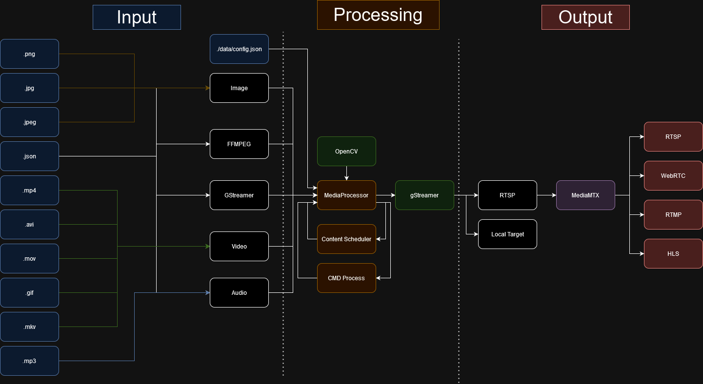

# StreamChannelAssembler
 Create and publish streams from a folder of images, videos and livefeeds. Just place your arbitrary images and videos in the `./data/contents/` folder and run the application. By utilizing gStreamer and OpenCV the images will be livestreamed to a channel or locally. JSON files with links to webcam or other live feeds can also be used. The stream can then be sent to various media servers. The current implementation is only a MVP (Minimum Viable Product) and more features will be added further on. Check out the `./data/config.json` file to change settings.


 // TODO:

# Motivation
To be fair, I am quite rusty in `C++`, which motivates the decision to create a new project in `C++`. The focus with the project is to create clean and good practice code towards high performing computing. Video streaming is a computer resource heavy task which fit perfectly. The application is strongly coupled to gStreamer and OpenCV which are great libraries to learn when renewing one's code language skills. This was also a great opportunity for me to try out the `MediaMTX` project.

# Running
The general usercase is as follows:
1. Place all wanted content in `./data/contents/` folder. (Optionally remove the examples)
2. Update `./data/config.json` to change general settings such as output location, playlist order, overlays and animations.
3. Execute the code locally or docker. (See more below.)
4. View the stream. (If chosen to play locally, the stream will be shown as soon as the application starts running.)
5. Enjoy!

**NOTE**: For fast run use `./run.sh` it will trigger docker-compose and then open VLC or gStreamer to visualize the stream if installed.

# Executing locally
Firstly install dependencies as in the `Dockerfile`.
Then compile, build and run the application by running the following command:
```bash
cmake -S . -B build && cmake --build build && ./build/StreamChannelAssembler
```
**NOTE**: The main advantage with running locally is that the stream can be viewed locally without an X-server. Using docker though, the project build will be volumed, which means the project can then be run locally but built in docker container.
# Executing Docker
This repository has been dockerized. Install docker and run command below.
It is recommended to use mediaMTX in docker, which means the video will be streamed to an url, which can be collected using vlc or gStreamer. This can be accomplished by running the commands below or using the `./run.sh` script. The build will also be volumed, which means you can run the application locally too.

```bash
# Build and run the container and stream
docker-compose up
# View Stream in vlc (if installed!) by running
vlc rtsp://localhost:554/livestream
```
The built project is volumed to the local folder `./build`.
The data folder is also volumed so as to share the content with the docker container easily.

# Testing

Unit Tests are written using `Catch2`, they are linked to github actions. Tests will be built with the rest of the project. //TODO: update this

# Examples

These are some examples of streams that can be added to the content folder except for videos and images.
//TODO:
```json
{
    "name": "Test Video Example",
    "type": "video",
    "target": "videotestsrc ! videoconvert ! appsink",
    "length": 20, // how many seconds the live stream should play
    "start": 0 // where in the stream we should start
}
```
**NOTE**: Comments using "//" are not allowed in json syntax, so remove the comments if you are trying this example out.

```json
{
    "name": "Local Webcam Example",
    "type": "video",
    "target": 0,
    "length": 20,
}
```
These JSON objects can be seen as defining the input to the application.


# Supported Data Types
This list show supported datatypes in a table.

| FileType | ContentType | Explanation | Status |
|----------|----------|----------|----------|
| .png   | Image   | Std. Type |  |
| .jpg   | Image   | Std. Type  |  |
| .jpeg   | Image   | Std. Type |  |
| .json   | GStreamer   | Define a gStreamer command to appsink. See gstreamer_example.json   |  |
| .json   | FFMPEG   | Define a FFMPEG command to app. See ffmpeg_example.json   |  |
| .json   | Video   | Define a file or command as video. See webcam_example.json   |  |
| .json   | Audio   | Define a file or command as audio. See radio_example.json  |  |
| .json   | Image   | Define a file or command as image.  |  |
| .mp4   | Video   | Std. Type  |  |
| .avi   | Video   | Std. Type |  |
| .mov   | Video   | Std. Type |  |
| .gif   | Video   | Gif:s are seen as video. |  |
| .mkv   | Video   | Std. Type |  |
| .mp3   | Audio   | Std. Type |  |

How the formats are handled by the media processors are illustrated in the figure below.


# Relevant links during execution
These links are relevant too know when running the docker-compose file.
* [http://localhost:8888/livestream/](http://localhost:8888/livestream/) - View FLV HLS
* [http://localhost:80](http://localhost:80) - Example standalone WebView hosted by Nginx

# Known issues

This is a list of known issues that hopefully will be solved in near future:

* readme need more examples and helpful tips of how to run and so on.
* demo added to readme
* add scheduler
* add a couple of playlist orders, such as random
* fix local view in a manageable windowform
* no animations

# Some major sources

* https://stackoverflow.com/questions/37339184/how-to-write-opencv-mat-to-gstreamer-pipeline
* https://chat.openai.com/
* https://github.com/bluenviron/mediamtx
* https://github.com/nlohmann/json


# License

This project is under the MIT license, read more [here](/LICENSE).

Copyright (c) 2023 Grebtsew
